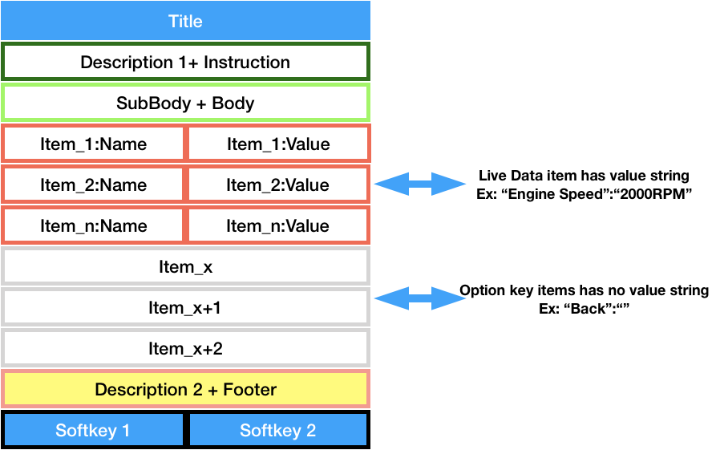
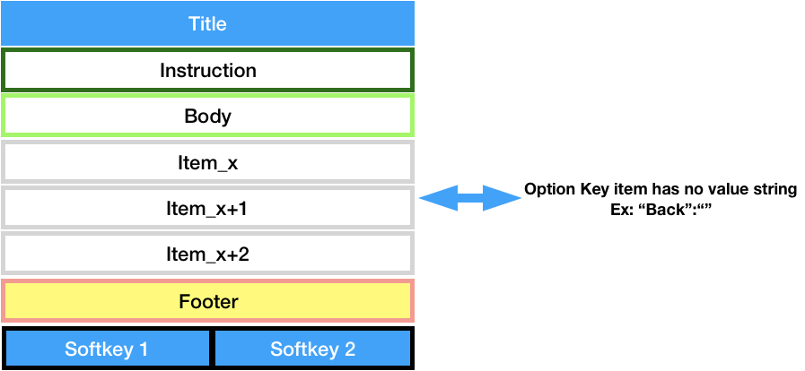
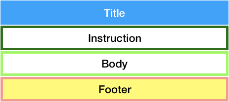
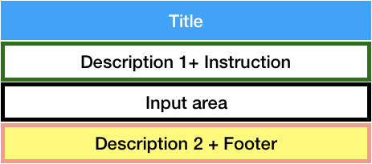

= Innova VCI Service

Source code of this service content in folder: innova-vci-service

:sectnums:
:sectnumlevels: 5

== Author
    Hung Vo <hungtv@vn.innova.com>
    Quoc Do <quocmd@vn.innova.com>
    Nguyen Pham <nguyencp@vn.innova.com>

== Revision

Version: 1.0

Version Date: Jun 15,2019

Version Notes: First Release for {doctitle}

Version: 1.2RC1

Version Date: Jul 21,2019

Version Notes:

    # Update
    getVersion
    getBatteryVoltage
    obd2RetriveData : read service 9
    # report method obd2
    getVehReport_YMME_PROFILE
    getVehReport_OBD2_LD_SID1_BUFF
    getVehReport_OBD2_FF_SID2_BUFF
    getVehReport_OBD2_DTC_SID37A_BUFF
    getVehReport_OBD2_SPECIALTEST_SID568_BUFF
    getVehReport_OBD2_VEHINFO_SID9_BUFF
    getVehReport_OBD2_RECORED_LD_BUFF

Version: 1.3

Version Date: August 02,2019

Version Notes:

        # Update
        add link_OBD2_SPECIALTEST_SID5
        add link_OBD2_SPECIALTEST_SID6
        add link_OBD2_SPECIALTEST_SID8
        add getVehReport_OBD2_SPECIALTEST_SID5_BUFF
        add getVehReport_OBD2_SPECIALTEST_SID6_BUFF
        add getVehReport_OBD2_SPECIALTEST_SID8_BUFF
        remove getVehReport_OBD2_SPECIALTEST_SID568_BUFF
        Update ofm features, MIL Status and Drive Cycle

Version: 1.4

Version Date: Oct 01,2019

Version Notes:

        # Update
        add features using screen form (Special Test and Actuator Test)
        add erase OBD2

Version: 1.5

Version Date: Oct 22,2019

Version Notes:

        # Update
        add features using screen form (Oil Reset, Battery Reset, Steering Angle Sensor Calibration, Electric Parking Brake, ABS Bleeding)
        update new response of nwscan_LinkSystem
        add nwscan_getdtcdef to get dtc definition
        update live data functions
        add tool setting

Version: 1.6

Version Date: Nov 11,2019

Version Notes:

        # Update
        Update introduction of USB serial and bluetooth
        Update progress bar process
        Update command get information of Live Data item (Max val, Min Val, and Unit)

Version: 1.7

Version Date: Dec 07,2019

Version Notes:

        # Update
        Update itemlist of OBD2, ABS, SRS LiveData
        Update Hybrid LiveData
        Update enable and disable DTC trigger function

Version: 1.8

Version Date: Jan 08,2020

Version Notes:

        # Update
        Update service reset functions, battery alternator health check

Version: 1.8RC2

Version Date: Jan 20,2020

Version Notes:

        # Update
        Update OBD2 readable functions
        getVehReport_YMME_String
        getVehReport_MonitorIconStatus
        getVehReport_FreezeFrameDTCInfo
        getVehReport_FreezeFrameLDInfo
        getVehReport_OBD2_DTC_Info
        getVehReport_OBD2_DTC_Def
        getVehReport_OBD2_VehicleInfo_SID9

Version: 1.9

Version Date: Feb 12,2020

Version Notes:

        # Update
        Update Fast Cancel

Version: 1.10

Version Date: Apr 29,2020

Version Notes:

        # Update
        Update Doc

Version: 1.10RC2

Version Date: Jun 03,2020

Version Notes:

        # Update
        Update obd2QuickRetriveData, obd2QuickLink

Version: 1.11

Version Date: Jul 20,2020

Version Notes:

        # Update
        Update readGUID, writeGUID in OBD Tool

Version: 1.12

Version Date: Aug 17,2020

Version Notes:

        # Update
        Update check ECU Voltage to break OBD2Query

Version: 1.12RC1

Version Date: Sep 06,2020

Version Notes:

        # Update
        Update VCI Logging Data functions

Version: 1.12RC2

Version Date: Oct 06,2020

Version Notes:

        # Update
        Update doc GUI process with keep alive and finish response from VCI

Version: 1.14

Version Date: Oct 08,2020

Version Notes:

        # Update
        Update ECM Live Data

Version: 1.15

Version Date: Jan 28 2021

Version Notes:

        # Update
        Support Live Data with up to 1000 Pids . Please see the new update in R&D app tab7.page.ts

Version: 1.16

Version Date: Apr 16 2021

Version Notes:

        # Update
        Fix issue get_itemval using livedata v2 support 1000 pids

Version: 1.16RC1

Version Date: May 07 2021

Version Notes:

        # Update
        Add productid ST VCI FS 0x2D5

Version: 1.16RC2

Version Date: Sep 16 2021

Version Notes:

        # Update
        Update new gui_set_key_option in GUI using new command gui_set_key_with_index:21

Version: 1.16RC3

Version Date: Jan 18 2022

Version Notes:

        # Update
        Update document for YMME manual selection

Version: 1.16RC4

Version Date: Apr 20 2022

Version Notes:

        # Update
        Update Erase DTC support negative response return result Error Code
        Add retreiveFFDTCMonData, retreiveDTCData, obd2FFDTCMonLink, obd2DTCLink

Version: 1.16RC6

Version Date: Jun 23 2022

Version Notes:

          # Update
        add Smog Check I/M program function: getting_ledstatus, getting_smogcheckstate, getting_smogcheckcountry
        add get fuel type & get vehicle type function: getting_vehtype, getting_fueltype

== Scope
Handle USB Communication. This service will handle Vehicle communication via USB

Support Handle process :

    OBD2 Auto link
    OEM Pid (Odometer , Fuel Level ... )
    Network Scan
    Service Reset
    Live Data

== Dependency

    "devDependencies": {
        "buffer": "^5.2.1",
        "lodash": "^4.17.11",
        "@ionic-native/serial": "^5.3.0"
        "@ionic-native/bluetooth-serial": "^5.15.0",
    }

== OBD Tool

=== Methods

==== getVersion

    @input : none
    @return : Promise<{productid,main,boot,apiVersion}>

_Example:_

    return json as format {"productid":720,"main":"V01.12.03","boot":"V01.07.01","apiVersion":"1.2"}

==== getBatteryVoltage

    @input : none
    @return : Promise<{BatteryVoltage,Unit}>

_Example:_

    read battery voltage , return json format {"BatteryVoltage":11.91,"Unit":"V"}

==== cancel_process
TIP: Use this function to fast cancel processing

    @input : none
    @return : none

==== readGUID
TIP: Function to read GUID

    @input : none
    @return : string of GUID

==== writeGUID
TIP: Function to write new

    @input : string of new GUID
    @return : boolean true if write ok, otherwise is false

== OBD2

=== Methods

==== obd2Query

TIP: Use to query OBD2 Protocol , user can feed callback function to get process info. When OBDII not unplug, VCI not continue query.

[source,java]
----
obd2Query(cb?: ({ percent, index, total, message, isfinish }: {
       percent: any;
       index: any;
       total: any;
       message: any;
       isfinish: any;
    }) => any): Promise<enumProtocol>
----
     @param cb — use to notify linking info when OBII Cable plugging
     @returns — linked protocol

==== obd2RetriveData
[TIP]
====
Use to get obd2 data :

* Monitor Icon

* Freeze Frame

* DTC

* Vin Number

* Read Service 9

* Get report command , (Raw Data Format)
====

[source,java]
----
    obd2RetriveData(cb?: ({ message }: {
        message: any;
    }) => any): Promise<any>
    Reading of full obd2 : Monitor Icon , FF , DTC , VIN and Get Report
----

    @param cb
    @returns — Message getting Monitor icon, FF, Dtc, VIN, full report

[source,java]
----
        obd2QuickRetriveData(cb?: ({ message }: {
            message: any;
        }) => any): Promise<any>
        Reading VIN
----

    @param cb
    @returns — message getting VIN

[source,java]
----
        retreiveFFDTCMonData(cb?: ({ message }: {
            message: any;
        }) => any): Promise<any>
        Reading: FF, DTC, MonitorIcon.
----

    @param cb
    @returns — message getting FF, DTC, MonitorIcon

[source,java]
----
        retreiveDTCData(cb?: ({ message }: {
            message: any;
        }) => any): Promise<any>
        Reading DTC only
----

    @param cb
    @returns — message getting DTC

==== obd2AutoLink
TIP: This method will call query protocol , then if detected protocol , it will involve obd2RetriveData

==== obd2FFDTCMonLink
TIP: Same as obd2AutoLink but only retrive FF & DTC & Monitor Icon

==== obd2DTCLink
TIP: Same as obd2AutoLink but only retrive DTC

==== getVehReport_YMME_PROFILE

    @input : none
    @return : Promise<Array<{bufferIndex:Number,data:[]}>>

_Example:this method read current ymme profile in device_

    [{"bufferIndex":0,"data":"[aa 31 46 4d 35 4b 37 46 38 32 4a 47 41 32 38 32 32 39 00 03 00 26 00 0c 00 0a 00 ff ff ff ff 1a 00 00 00 00 00 00 00 00 00 00 00 00 00 00 00 00 00 00 00 00 00 00 00 00 00 00 00 00 00 00 00 00 00 00 00 00 00 00 00 00 00 00 00 00 00 00 00 00 00 00 00 00 00 00 00 00 00 00 00 00 00 00 00 00 00 00 00 00 00 00 00 00 00 00 00 00 00 00 00 00 00 00 00 00 00 00 00 00 00 00 00 00 00 00 00 00 00 00 00 00 00 00 00 00 00 00 00 00 00 00 00 00 00 00 00 00 00 00 00 00 00 00 00 00 00 00 00 00 00 00 00 00 00 00 00 00 00 00 00 00 00 00 00 00 00 00 00 00 00 00 00 00 00 00 00 00 00 00 00 00 00 00 00 00 00 00 00 00 00 00 00 00 00 00 00 00 00 00 00 00 00 00 00 00 00 00 00 00 00 00 00 00 00 00 00 00 00 00 00 00 00 00 00 00 00 00 00 00 00 00 00 00 00 00 00 00 00 00 00 00 00 00 00 00 00 00 00 00 00 00 00 00 00 00 00 00 00 00 00 00 00 00 00 00 00 00 00 00 00 00 00 00 00 00 00 00 00 00 00 00 00 00 00 00 00 00 00 00 00 00 00 00 00 00 00 00 00 00 00 00 00 00 00 00 00 00 00 00 00 00 00 00 00 00 00 00 00 00 00 00 00 00 00 00 00 00 00 00 00 00 00 00 00 00 00 00 00 00 00 00 00 00 00 00 00 00 00 00 00 00 00 00 00 00 00 00 00 00 00 00 00 00 00 00 00 00 00 00 00 00 00 00 00 00 00 00 00 00 00 00 00 00 00 00 00 00 00 00 00 00 00 00 00 00 00 00 00 00 00 00 00 00 00 00 00 00 00 00 00 00 00 00 00 00 00 00 00 00 00 00 00 00 00 00 00 00 00 00 00 00 00 00 00 00 00 00 00 00 00 00 00 00 00 00 00 00 00 00 00 00 00 00 00 00 00 00 00 00 00 00 00 00 00 00 00 00 00 00 00 00 00 00 00 00 00 00 00 00 00 00 00 00 00 00 00 00 00 00 00 00 00 00 00 00 00 00 00 00 00 00]"}]

==== getVehReport_OBD2_LD_SID1_BUFF

    @input : none
    @return : Promise<Array<{bufferIndex:Number,data:[]}>>

_Example:This method use to read LD Buff ECU and TCU return_

    [{"bufferIndex":0,"data":"[aa be 3f a8 13 00 07 e5 e5]"},{"bufferIndex":1,"data":"[aa 98 18 80 13 81 04 00 00]"}]

==== getVehReport_OBD2_FF_SID2_BUFF

    @input : none
    @return : Promise<Array<{bufferIndex:Number,data:[]}>>

_Example:This method read raw data of buffer freeze frame ecu and tcu return_

    [{"bufferIndex":0,"data":"[aa 26 00 00 02 00 00 04 aa 20 02 04 00 04 aa 40 02 08 00 04 aa 01 02 0c 00 04 aa 02 02 10 00 02 aa 03 02 12 00 00 aa 04 02 12 00 00 aa 05 02 12 00 00 aa 06 02 12 00 00 aa 07 02 12 00 00 aa 0b 02 12 00 00 aa 0c 02 12 00 00 aa 0d 02 12 00 00 aa 0e 02 12 00 00 aa 0f 02 12 00 00 aa 10 02 12 00 00 aa 11 02 12 00 00 aa 15 02 12 00 00 aa 1f 02 12 00 00 aa 2c 02 12 00 00 aa 2e 02 12 00 00 aa 2f 02 12 00 00 aa 30 02 12 00 00 aa 31 02 12 00 00 aa 32 02 12 00 00 aa 33 02 12 00 00 aa 34 02 12 00 00 aa 3c 02 12 00 00 aa 41 02 12 00 00 aa 42 02 12 00 00 aa 43 02 12 00 00 aa 44 02 12 00 00 aa 45 02 12 00 00 aa 46 02 12 00 00 aa 47 02 12 00 00 aa 49 02 12 00 00 aa 4a 02 12 00 00 aa 4c 02 12 00 00 aa 00 00 00 00 00 00 00 00 00 00 00 00 00 00 00 00 00 00 00 00 00 00 00 00 00 00 00 00 00 00 00 00 00 00 00 00 00 00 00 00 00 00 00 00 00 00 00 00 00 00 00 00 00 00 00 00 00 00 00 00 00 00 00 00 00 00 00 00 00 00 00 00 00 00 00 00 00 00 00 00 00 00 00 00 00 00 00 00 00 00 00 00 00 00 00 00 00 00 00 00 00 00 00 00 00 00 00 00 00 00 00 00 00 00 00 00 00 00 00 00 00 00 00 00 00 00 00 00 00 00 00 00 00 00 00 00 00 00 00 00 00 00 00 00 00 00 00 00 00 00 00 00 00 00 00 00 00 00 00 00 00 00 00 00 00 00 00 00 00 00 00 00 00 00 00 00 00 00 00 00 00 00 00 00 00 00 00 00 00 00 00 00 00 00 00 00 00 00 00 00 00 00 00 00 00 00 00 00 00 00 00 00 00 00 00 00 00 00 00 00 00 00 00 00 00 00 00 00 00 00 00 00 00 00 00 00 00 00 00 00 00 00 00 00 00 00 00 00 00 00 00 00 00 00 00 00 00 00 00 00 00 00 00 00 00 00 00 00 00 00 00 00 00 00 00 00 00 00 00 00 00 00 00 00 00 00 00 00 00 00 00 00 00 00 00 00 00 00 00 00 00 00 00 00 00 00 00 00 00 00 00 00 00 00 00 00 00 00 00 00 00 00 00 00 00 00 00 00 00 00 00 00 00 00 00 00 00 00 00 00 00 00 00 00 00 00 00 00 00 00 00 00 00 00 00 00 00 00 00 00 00 00 00 00 00 00 00 00 00 00 00 00 00 00 00 00 00 00 00 00 00 00 00 00 00 00 00 00 00 00 00 00 00 00 00 00 00 00 00 00 00 00 00 00 00 00 00 00 00 00 00 00 00 00 00 00 00 00 00 00 00 00 00 00 00 00 00 00 00 00 00 00 00 00 00 00 00 00 00 00 00 00 00 00 00 00 00 00 00 00 00 00 00 00 00 00 00 00 00 00 00 00 00 00 00 00 00 00 00 00 00 00 00 00 00 00 00 00 00 00 00 00 00 00 00 00 00 00 00 00 00 00 00 00 00 00 00 00 00 00 00 00 00 00 00 00 00 00 00 00 00 00 00 00 00 00 00 00 00 00 00 00 00 00 00 00 00 00 00 00 00 00 00 00 00 00 00 00 00 00 00 00 00 00 00 00 00 00 00 00 00 00 00 00 00 00 00 00 00 00 00 00 00 00 00 00 00 00 00 00 00 00 00 00 00 00 00 00 00 00 00 00 00 00 00 00 00 00 00 00 00 00 00 00 00 00 00 00 00 00 00 00 00 00 00 00 00 00 00 00 00 00 00 00 00 00 00 00 00 00 00 00 00 00 00 00 00 00 00 00 00 00 00 00 00 00 00 00 00 00 00 00 00 00 00 00 00 00 00 00 00 00 00 00 00 00 00 00 00 00 00 00 00 00 00 00 00 00 00 00 00 00 00 00 00 00 00 00 00 00 00 00 00 00 00 00 00 00 00 00 00 00 00 00 00 00 00 00 00 00 00 00 00 00 00 00 00 00 00 00 00 00 00 00 00 00 00 00 00 00 00 00 00 00 00 00 00 00 00 00 00 00 00 00 00 00 00 00 00 00 00 00 00 00 00 00 00 00 00 00 00 00 00 00 00 00 00 00 00 00 00 00 00 00 00 00 00 00 00 00 00 00 00 00 00 00 00 00 00 00 00 00 00 00 00 00 00 00 00 00 00 00 00 00 00 00 00 00 00 00 00 00 00 00 00 00 00 00 00 00 00 00 00 00 00 00 00 00 00 00 00 00 00 00 00 00 00 00 00 00 00 00 00 00 00 00 00 00 00 00 00 00 00 00 00 00 00 00 00 00 00 00 00 00 00 00 00 00 00 00 00 00 00 00 00 00 00 00 00 00 00 00 00 00 00 00 00 00 00 00 00 00 00 00 00 00 00 00 00 00 00 00 00 00 00 00 00 00 00 00 00 00 00 00 00 00 00 00 00 00 00 00 00 00 00 00 00 00 00 00 00 00 00 00 00 00 00 00 00 00 00 00 00 00 00 00 00 00 00 00 00 00 00 00 00 00 00 00 00 00 00 00 00 00 00 00 00 00 00 00 00 00 00 00 00 00 00 00 00 00 00 00 fe 3f 88 03 00 17 f0 11 fe d0 00 00 00 07 e5 e5 f0 09 00 00 00 00 00 00 00 00 00 00 00 00 00 00 00 00 00 00 00 00 00 00 00 00 00 00 00 00 00 00 00 00 00 00 00 00 00 00 00 00 00 00 00 00 00 00 00 00 00 00 00 00 00 00 00 00 00 00 00 00 00 00 00 00 00 00 00 00 00 00 00 00 00 00 00 00 00 00 00 00 00 00 00 00 00 00 00 00 00 00 00 00 00 00 00 00 00 00 00 00 00 00 00 00 00 00 00 00 00 00 00 00 00 00 00 00 00 00 00 00 00 00 00 00 00 00 00 00 00 00 00 00 00 00 00 00 00 00 00 00 00 00 00 00 00 00 00 00 00 00 00 00 00 00 00 00 00 00 00 00 00 00 00 00 00 00 00 00 00 00 00 00 00 00 00 00 00 00 00 00 00 00 00 00 00 00 00 00 00 00 00 00 00 00 00 00 00 00 00 00 00 00 00 00 00 00 00 00 00 00 00 00 00 00 00 00 00 00 00 00 00 00 00 00 00 00 00 00 00 00 00 00 00 00 00 00 00 00 00 00 00 00 00 00 00 00 00 00 00 00 00 00 00 00 00 00 00 00 00 00 00 00 00 00 00 00 00 00 00 00 00 00 00 00 00 00 00 00 00 00 00 00 00 00 00 00 00 00 00 00 00 00 00 00 00 00 00 00 00 00 00 00 00 00 00 00 00 00 00 00 00 00 00 00 00 00 00 00 00 00 00 00 00 00 00 00 00 00 00 00 00 00 00 00 00 00 00 00 00 00 00 00 00 00 00 00 00 00 00 00 00 00 00 00 00 00 00 00 00 00 00 00 00 00 00 00 00 00 00 00 00 00 00 00 00 00 00 00 00 00 00 00 00 00 00 00 00 00 00 00 00 00 00 00 00 00 00 00 00 00 00 00 00 00 00 00 00 00 00 00 00 00 00 00 00 00 00 00 00 00 00 00 00 00 00 00 00 00 00 00 00 00 00 00 00 00 00 00 00 00 00 00 00 00 00 00 00 00 00 00 00 00 00 00 00 00 00 00 00 00 00 00 00 00 00 00 00 00 00 00 00 00 00 00 00 00 00 00 00 00 00 00 00 00 00 00 00 00 00 00 00 00 00 00 00 00 00 00 00 00 00 00 00 00 00 00 00 00 00 00 00 00 00 00 00 00 00 00 00 00 00 00 00 00 00 00 00 00 00 00 00 00 00 00 00 00 00 00 00 00 00 00 00 00 00 00 00 00 00 00 00 00 00 00 00 00 00 00 00 00 00 00 00 00 00 00 00 00 00 00 00 00 00 00 00 00 00 00 00 00 00 00 00 00 00 00 00 00 00 00 00 00 00 00 00 00 00 00 00 00 00 00 00 00 00 00 00 00 00 00 00 00 00 00 00 00 00 00 00 00 00 00 00 00 00 00 00 00 00 00 00 00 00 00 00 00 00 00 00 00 00 00 00 00 00 00 00 00 00 00 00 00 00 00 00 00 00 00 00 00 00 00 00 00 00 00 00 00 00 00 00 00 00 00 00 00 00 00 00 00 00 00 00 00 00 00 00 00 00 00 00 00 00 00 00 00 00 00 00 00 00 00 00 00 00 00 00 00 00 00 00 00 00 00 00 00 00 00 00 00 00 00 00 00 00 00 00 00 00 00 00 00 00 00 00 00 00 00 00 00 00 00 00 00 00 00 00 00 00 00 00 00 00 00 00 00 00 00 00 00 00 00 00 00 00 00 00 00 00 00 00 00 00 00 00 00 00 00 00 00 00 00 00 00 00 00 00 00 00 00 00 00 00 00 00 00 00 00 00 00 00 00 00 00 00 00 00 00 00 00 00 00 00 00 00 00 00 00 00 00 00 00 00 00 00 00 00 00 00 00 00 00 00 00 00 00 00 00 00 00 00 00 00 00 00 00 00 00 00 00 00 00 00 00 00 00 00 00 00 00 00 00 00 00 00 00 00 00 00 00 00 00 00 00 00 00 00 00 00 00 00 00 00 00 00 00 00 00 00 00 00 00 00 00 00 00 00 00 00 00 00 00 00 00 00 00 00 00 00 00 00 00 00 00 00 00 00 00 00 00 00 00 00 00 00 00 00 00 00 00 00 00 00 00 00 00 00 00 00 00 00 00 00 00 00 00 00 00 00 00 00 00 00 00 00 00 00 00 00 00 00 00 00 00 00 00 00 00 00 00 00 00 00 00 00 00 00 00 00 00 00 00 00 00 00 00 00 00 00 00 00 00 00 00 00 00 00 00 00 00 00 00 00 00 00 00]"},{"bufferIndex":1,"data":"[aa 0c 00 00 02 00 00 04 aa 20 02 04 00 04 aa 40 02 08 00 04 aa 02 02 0c 00 02 aa 04 02 0e 00 00 aa 05 02 0e 00 00 aa 0c 02 0e 00 00 aa 0d 02 0e 00 00 aa 11 02 0e 00 00 aa 1f 02 0e 00 00 aa 42 02 0e 00 00 aa 49 02 0e 00 00 aa 00 00 00 00 00 00 00 00 00 00 00 00 00 00 00 00 00 00 00 00 00 00 00 00 00 00 00 00 00 00 00 00 00 00 00 00 00 00 00 00 00 00 00 00 00 00 00 00 00 00 00 00 00 00 00 00 00 00 00 00 00 00 00 00 00 00 00 00 00 00 00 00 00 00 00 00 00 00 00 00 00 00 00 00 00 00 00 00 00 00 00 00 00 00 00 00 00 00 00 00 00 00 00 00 00 00 00 00 00 00 00 00 00 00 00 00 00 00 00 00 00 00 00 00 00 00 00 00 00 00 00 00 00 00 00 00 00 00 00 00 00 00 00 00 00 00 00 00 00 00 00 00 00 00 00 00 00 00 00 00 00 00 00 00 00 00 00 00 00 00 00 00 00 00 00 00 00 00 00 00 00 00 00 00 00 00 00 00 00 00 00 00 00 00 00 00 00 00 00 00 00 00 00 00 00 00 00 00 00 00 00 00 00 00 00 00 00 00 00 00 00 00 00 00 00 00 00 00 00 00 00 00 00 00 00 00 00 00 00 00 00 00 00 00 00 00 00 00 00 00 00 00 00 00 00 00 00 00 00 00 00 00 00 00 00 00 00 00 00 00 00 00 00 00 00 00 00 00 00 00 00 00 00 00 00 00 00 00 00 00 00 00 00 00 00 00 00 00 00 00 00 00 00 00 00 00 00 00 00 00 00 00 00 00 00 00 00 00 00 00 00 00 00 00 00 00 00 00 00 00 00 00 00 00 00 00 00 00 00 00 00 00 00 00 00 00 00 00 00 00 00 00 00 00 00 00 00 00 00 00 00 00 00 00 00 00 00 00 00 00 00 00 00 00 00 00 00 00 00 00 00 00 00 00 00 00 00 00 00 00 00 00 00 00 00 00 00 00 00 00 00 00 00 00 00 00 00 00 00 00 00 00 00 00 00 00 00 00 00 00 00 00 00 00 00 00 00 00 00 00 00 00 00 00 00 00 00 00 00 00 00 00 00 00 00 00 00 00 00 00 00 00 00 00 00 00 00 00 00 00 00 00 00 00 00 00 00 00 00 00 00 00 00 00 00 00 00 00 00 00 00 00 00 00 00 00 00 00 00 00 00 00 00 00 00 00 00 00 00 00 00 00 00 00 00 00 00 00 00 00 00 00 00 00 00 00 00 00 00 00 00 00 00 00 00 00 00 00 00 00 00 00 00 00 00 00 00 00 00 00 00 00 00 00 00 00 00 00 00 00 00 00 00 00 00 00 00 00 00 00 00 00 00 00 00 00 00 00 00 00 00 00 00 00 00 00 00 00 00 00 00 00 00 00 00 00 00 00 00 00 00 00 00 00 00 00 00 00 00 00 00 00 00 00 00 00 00 00 00 00 00 00 00 00 00 00 00 00 00 00 00 00 00 00 00 00 00 00 00 00 00 00 00 00 00 00 00 00 00 00 00 00 00 00 00 00 00 00 00 00 00 00 00 00 00 00 00 00 00 00 00 00 00 00 00 00 00 00 00 00 00 00 00 00 00 00 00 00 00 00 00 00 00 00 00 00 00 00 00 00 00 00 00 00 00 00 00 00 00 00 00 00 00 00 00 00 00 00 00 00 00 00 00 00 00 00 00 00 00 00 00 00 00 00 00 00 00 00 00 00 00 00 00 00 00 00 00 00 00 00 00 00 00 00 00 00 00 00 00 00 00 00 00 00 00 00 00 00 00 00 00 00 00 00 00 00 00 00 00 00 00 00 00 00 00 00 00 00 00 00 00 00 00 00 00 00 00 00 00 00 00 00 00 00 00 00 00 00 00 00 00 00 00 00 00 00 00 00 00 00 00 00 00 00 00 00 00 00 00 00 00 00 00 00 00 00 00 00 00 00 00 00 00 00 00 00 00 00 00 00 00 00 00 00 00 00 00 00 00 00 00 00 00 00 00 00 00 00 00 00 00 00 00 00 00 00 00 00 00 00 00 00 00 00 00 00 00 00 00 00 00 00 00 00 00 00 00 00 00 00 00 00 00 00 00 00 00 00 00 00 00 00 00 00 00 00 00 00 00 00 00 00 00 00 00 00 00 00 00 00 00 00 00 00 00 00 00 00 00 00 00 00 00 00 00 00 00 00 00 00 00 00 00 00 00 00 00 00 00 00 00 00 00 00 00 00 00 00 00 00 00 00 00 00 00 00 00 00 00 00 00 00 00 00 00 00 00 00 00 00 00 00 00 00 00 00 00 00 00 00 00 00 00 00 00 00 00 00 00 00 00 00 00 00 00 00 00 00 00 00 00 00 00 00 00 00 00 00 00 00 00 00 00 00 00 00 00 00 00 00 00 00 00 00 00 00 00 00 00 00 00 00 00 00 00 00 00 00 00 00 00 00 00 00 00 00 00 00 00 00 00 00 00 00 00 00 00 00 00 00 00 00 00 00 00 00 00 00 00 00 00 00 00 00 00 00 00 00 00 00 00 00 00 00 00 00 00 00 00 00 00 00 00 00 00 00 00 00 00 00 00 00 00 00 00 00 00 00 00 00 00 00 00 00 00 00 00 00 58 18 80 03 00 00 00 01 40 80 00 00 c1 00 00 00 00 00 00 00 00 00 00 00 00 00 00 00 00 00 00 00 00 00 00 00 00 00 00 00 00 00 00 00 00 00 00 00 00 00 00 00 00 00 00 00 00 00 00 00 00 00 00 00 00 00 00 00 00 00 00 00 00 00 00 00 00 00 00 00 00 00 00 00 00 00 00 00 00 00 00 00 00 00 00 00 00 00 00 00 00 00 00 00 00 00 00 00 00 00 00 00 00 00 00 00 00 00 00 00 00 00 00 00 00 00 00 00 00 00 00 00 00 00 00 00 00 00 00 00 00 00 00 00 00 00 00 00 00 00 00 00 00 00 00 00 00 00 00 00 00 00 00 00 00 00 00 00 00 00 00 00 00 00 00 00 00 00 00 00 00 00 00 00 00 00 00 00 00 00 00 00 00 00 00 00 00 00 00 00 00 00 00 00 00 00 00 00 00 00 00 00 00 00 00 00 00 00 00 00 00 00 00 00 00 00 00 00 00 00 00 00 00 00 00 00 00 00 00 00 00 00 00 00 00 00 00 00 00 00 00 00 00 00 00 00 00 00 00 00 00 00 00 00 00 00 00 00 00 00 00 00 00 00 00 00 00 00 00 00 00 00 00 00 00 00 00 00 00 00 00 00 00 00 00 00 00 00 00 00 00 00 00 00 00 00 00 00 00 00 00 00 00 00 00 00 00 00 00 00 00 00 00 00 00 00 00 00 00 00 00 00 00 00 00 00 00 00 00 00 00 00 00 00 00 00 00 00 00 00 00 00 00 00 00 00 00 00 00 00 00 00 00 00 00 00 00 00 00 00 00 00 00 00 00 00 00 00 00 00 00 00 00 00 00 00 00 00 00 00 00 00 00 00 00 00 00 00 00 00 00 00 00 00 00 00 00 00 00 00 00 00 00 00 00 00 00 00 00 00 00 00 00 00 00 00 00 00 00 00 00 00 00 00 00 00 00 00 00 00 00 00 00 00 00 00 00 00 00 00 00 00 00 00 00 00 00 00 00 00 00 00 00 00 00 00 00 00 00 00 00 00 00 00 00 00 00 00 00 00 00 00 00 00 00 00 00 00 00 00 00 00 00 00 00 00 00 00 00 00 00 00 00 00 00 00 00 00 00 00 00 00 00 00 00 00 00 00 00 00 00 00 00 00 00 00 00 00 00 00 00 00 00 00 00 00 00 00 00 00 00 00 00 00 00 00 00 00 00 00 00 00 00 00 00 00 00 00 00 00 00 00 00 00 00 00 00 00 00 00 00 00 00 00 00 00 00 00 00 00 00 00 00 00 00 00 00 00 00 00 00 00 00 00 00 00 00 00 00 00 00 00 00 00 00 00 00 00 00 00 00 00 00 00 00 00 00 00 00 00 00 00 00 00 00 00 00 00 00 00 00 00 00 00 00 00 00 00 00 00 00 00 00 00 00 00 00 00 00 00 00 00 00 00 00 00 00 00 00 00 00 00 00 00 00 00 00 00 00 00 00 00 00 00 00 00 00 00 00 00 00 00 00 00 00 00 00 00 00 00 00 00 00 00 00 00 00 00 00 00 00 00 00 00 00 00 00 00 00 00 00 00 00 00 00 00 00 00 00 00 00 00 00 00 00 00 00 00 00 00 00 00 00 00 00 00 00 00 00 00 00 00 00 00 00 00 00 00 00 00 00 00 00 00 00 00 00 00 00 00 00 00 00 00 00 00 00 00 00 00 00 00 00 00 00 00 00 00 00 00 00 00 00 00 00 00 00 00 00 00 00 00 00 00 00 00 00 00 00 00 00 00 00 00 00 00 00 00 00 00 00 00 00 00 00 00 00 00 00 00 00 00 00 00 00 00 00 00 00 00 00 00 00 00 00 00 00 00 00 00 00 00 00 00 00 00 00 00 00 00 00 00 00 00 00 00 00 00 00 00 00 00 00 00 00 00 00 00 00 00 00 00 00 00 00 00 00 00 00 00 00 00 00 00 00 00 00 00 00 00 00 00 00 00 00 00 00 00 00 00 00 00 00 00 00 00 00 00 00 00 00 00 00 00 00 00 00 00 00 00 00 00 00 00 00 00 00 00 00 00 00 00 00 00 00 00 00 00 00 00 00 00 00 00 00 00 00 00 00 00 00 00 00 00 00 00 00 00 00 00 00 00 00 00 00 00 00 00 00 00 00 00 00 00 00 00 00 00 00 00 00 00 00 00 00 00 00 00 00 00 00 00 00 00 00 00 00 00 00 00 00 00 00 00 00 00 00 00 00 00 00 00 00 00 00 00 00 00 00 00 00 00 00 00]"}]

==== getVehReport_OBD2_DTC_SID37A_BUFF

    @input : none
    @return : Promise<Array<{bufferIndex:Number,data:[]}>>

_Example: read dtc of 2 buffer ECU and TCU OBD2_

    [{"bufferIndex":0,"data":"[00 00 02 00 01 1d 00 e8 07 00 00 1c 09 02 f0 09 04 01 21 05 01 23 05 07 06 05 07 07 05 12 33 05 21 01 05 02 28 05 01 06 08 00 00 00 00 00 00 00 00 00 00 00 00 00 00 00 00 00 00 00 00 00 00 00 00 00 00 00 00 00 00 00 00 00 00 00 00 00 00 00 00 00 00 00 00 00 00 00 00 00 00 00 00 00 00 00 00 00 00 00 00 00 00 00 00 00 00 00 00 00 00 00 00 00 00 00 00 00 00 00 00 00 00 00 00 00 00 00 00 00 00 00 00 00 00 00 00 00 00 00 00 00 00 00 00 00 00 00 00 00 00 00 00 00 00 00 00 00 00 00 00 00 00 00 00 00 00 00 00 00 00 00 00 00 00 00 00 00 00 00 00 00 00 00 00 00 aa 00 00 00 00 00 00 00 00 00 00 00 00 00 00 00 00 00 00 00 00 00 00 00 00 00 00 00 00 00 00 00 00 00 00 00 00 00 00 00 00 00 00 00 00 00 00 00 00 00 00 00 00 00 00 00 00 00 00 00 00 00 00 00 00 00 00 00 00 aa]"},{"bufferIndex":1,"data":"[01 00 03 00 01 1d 00 e9 07 00 00 1c 01 02 f0 09 05 00 00 00 00 00 00 00 00 00 00 00 00 00 00 00 00 00 00 00 00 00 00 00 00 00 00 00 00 00 00 00 00 00 00 00 00 00 00 00 00 00 00 00 00 00 00 00 00 00 00 00 00 00 00 00 00 00 00 00 00 00 00 00 00 00 00 00 00 00 00 00 00 00 00 00 00 00 00 00 00 00 00 00 00 00 00 00 00 00 00 00 00 00 00 00 00 00 00 00 00 00 00 00 00 00 00 00 00 00 00 00 00 00 00 00 00 00 00 00 00 00 00 00 00 00 00 00 00 00 00 00 00 00 00 00 00 00 00 00 00 00 00 00 00 00 00 00 00 00 00 00 00 00 00 00 00 00 00 00 00 00 00 00 00 00 00 00 00 00 aa 00 00 00 00 00 00 00 00 00 00 00 00 00 00 00 00 00 00 00 00 00 00 00 00 00 00 00 00 00 00 00 00 00 00 00 00 00 00 00 00 00 00 00 00 00 00 00 00 00 00 00 00 00 00 00 00 00 00 00 00 00 00 00 00 00 00 00 00 aa]"}]

==== linkVehReport_OBD2_SPECIALTEST_SID5
TIP: This function to link OBD2 Service 5 in Special Test O2 Sensor

    @input : none
    @return : Promise<Array<{result:String}>>

_Example: link and get service 5 data store in sid5_buff_

    Success: {"result": "OK"}
    No Response: {"result": "Sent"}

==== getVehReport_OBD2_SPECIALTEST_SID5_BUFF
TIP: This function to get data of OBD2 Service 5 buffer which is gotten from link_OBD2_SPECIALTEST_SID5

    @input : none
    @return : Promise<Array<{}>>

_Example: get buffer of sid 05 with json format_

    //TODO

==== linkVehReport_OBD2_SPECIALTEST_SID6
TIP: This function to link OBD2 Service 6 in Special Test OBD Monitor

    @input : none
    @return : Promise<Array<{result:String}>>

_Example: link and get service 6 data store in sid6_buff_

    Success: {"result": "OK"}
    No Response: {"result": "Sent"}

==== getVehReport_OBD2_SPECIALTEST_SID6_BUFF
TIP: This function to get data of OBD2 Service 6 buffer which is gotten from link_OBD2_SPECIALTEST_SID6

    @input : none
    @return : Promise<Array<{}>>

_Example: get buffer of sid 06 with json format_

    {"Exhaust Gas Sensor Monitor Bank 1 - Sensor 1 ($01)":[["$7E8","HO2S11 Heater Current ($81)2)","0.000 (Amp)","0.000 (Amp)","0.000 (Amp)","OK"],["$7E8","UEGO11 Rich to Lean Response Time ($87)mp)","0.000 s(0 min,0 s)","0.000 s(0 min,0 s)","0.000 s(0 min,0 s)","OK"],["$7E8","UEGO11 Lean to Rich Response Time ($88)mp)","0.000 s(0 min,0 s)","0.000 s(0 min,0 s)","0.000 s(0 min,0 s)","OK"]],"Exhaust Gas Sensor Monitor Bank 1 - Sensor 2 ($02)":[["$7E8","HO2S12 sensor switch-point voltage ($01)p)","0.000000 (V)","0.000000 (V)","0.000000 (V)","OK"],["$7E8","HO2S12 Fuel Shut off Rich to Lean Response Rate ($85)(V)","0 (mV/s)","0 (mV/s)","0 (mV/s)","OK"],["$7E8","HO2S12 Fuel Shut off Rich to Lean Response Time ($86)(V)","0.000 s(0 min,0 s)","0.000 s(0 min,0 s)","0.000 s(0 min,0 s)","OK"]],"Catalyst Monitor Bank 1 ($21)":[["$7E8","Bank 1 index-ratio and max. limit ($80)nse Time ($86)(V)","0.0000000","0.0000000","0.0000000","OK"]],"EGR Monitor Bank 2 ($33)":[["$7E8","Component ID: $82","0.000000","0.000000","0.000000","OK"]],"VVT Monitor Bank 1 ($35)":[["$7E8","Camshaft Advanced Position Error Bank 1 ($80)00","0.00 (Angle)","0.00 (Angle)","0.00 (Angle)","OK"],["$7E8","Camshaft Retarded Position Error Bank 1 ($81)00","0.00 (Angle)","0.00 (Angle)","0.00 (Angle)","OK"]],"EVAP Monitor $7E8":[["$7E8","Phase 2 0.040” cruise leak check vacuum bleed-up and test limits ($80)le)","0.00 (inH2O)","0.00 (inH2O)","0.00 (inH2O)","OK"]]," (0.040”) ($3B)nk 1 - Sensor 2 ($02)tor General Data ($A1)":[["$7E8","Blocked Evap System Line - Screening test ($80)-up and test limits ($80)le)","0.00 (inH2O/s)","0.00 (inH2O/s)","0.00 (inH2O/s)","OK"],["$7E8","Blocked Evap System Line - Fault confirmation test ($81)est limits ($80)le)","0.00 (inH2O)","0.00 (inH2O)","0.00 (inH2O)","OK"],["$7E8","Vapor Blocking Valve Performance ($82)rmation test ($81)est limits ($80)le)","0.00 (inH2O)","0.00 (inH2O)","0.00 (inH2O)","OK"]],"nsor 2 ($02)tor General Data ($A1)":[["$7E8","Total engine misfire and catalyst damage misfire rate ($80) limits ($80)le)","0.000000 (%)","0.000000 (%)","0.000000 (%)","OK"],["$7E8","Total engine misfire and emission threshold misfire rate ($81)mits ($80)le)","0.000000 (%)","0.000000 (%)","0.000000 (%)","OK"],["$7E8","Highest catalyst-damage misfire and catalyst damage threshold misfire rate ($82)00000 (%)","0.000000 (%)","0.000000 (%)","0.000000 (%)","OK"],["$7E8","Highest emission-threshold misfire and emission threshold misfire rate ($83)$82)00000 (%)","0.000000 (%)","0.000000 (%)","0.000000 (%)","OK"],["$7E8","Inferred catalyst mid-bed temperature ($84)sion threshold misfire rate ($83)$82)00000 (%)","-40.0 (degree F)","-40.0 (degree F)","-40.0 (degree F)","OK"]],"Inferred catalyst mid-bed temperature ($84)sion threshold misfire rate ($83)$82)00000 (%)":[["$7E8","EWMA misfire counts for last 10 driving cycles ($0B)shold misfire rate ($83)$82)00000 (%)","0 (counts)","0 (counts)","0 (counts)","OK"],["$7E8","Misfire counts for last/current driving cycle ($0C))shold misfire rate ($83)$82)00000 (%)","0 (counts)","0 (counts)","0 (counts)","OK"],["$7E8","Cylinder X misfire rate and catalyst damage misfire rate ($80)ire rate ($83)$82)00000 (%)","0.000000 (%)","0.000000 (%)","0.000000 (%)","OK"],["$7E8","Cylinder X misfire rate and emission threshold misfire rate ($81) rate ($83)$82)00000 (%)","0.000000 (%)","0.000000 (%)","0.000000 (%)","OK"]],"ssion threshold misfire rate ($81) rate ($83)$82)00000 (%)":[["$7E8","EWMA misfire counts for last 10 driving cycles ($0B)re rate ($81) rate ($83)$82)00000 (%)","0 (counts)","0 (counts)","0 (counts)","OK"],["$7E8","Misfire counts for last/current driving cycle ($0C))re rate ($81) rate ($83)$82)00000 (%)","0 (counts)","0 (counts)","0 (counts)","OK"],["$7E8","Cylinder X misfire rate and catalyst damage misfire rate ($80)81) rate ($83)$82)00000 (%)","0.000000 (%)","0.000000 (%)","0.000000 (%)","OK"],["$7E8","Cylinder X misfire rate and emission threshold misfire rate ($81) rate ($83)$82)00000 (%)","0.000000 (%)","0.000000 (%)","0.000000 (%)","OK"]],"81) rate ($83)$82)00000 (%)":[["$7E8","EWMA misfire counts for last 10 driving cycles ($0B)re rate ($81) rate ($83)$82)00000 (%)","0 (counts)","0 (counts)","0 (counts)","OK"],["$7E8","Misfire counts for last/current driving cycle ($0C))re rate ($81) rate ($83)$82)00000 (%)","0 (counts)","0 (counts)","0 (counts)","OK"],["$7E8","Cylinder X misfire rate and catalyst damage misfire rate ($80)81) rate ($83)$82)00000 (%)","0.000000 (%)","0.000000 (%)","0.000000 (%)","OK"],["$7E8","Cylinder X misfire rate and emission threshold misfire rate ($81) rate ($83)$82)00000 (%)","0.000000 (%)","0.000000 (%)","0.000000 (%)","OK"]],"000000 (%)":[["$7E8","EWMA misfire counts for last 10 driving cycles ($0B)re rate ($81) rate ($83)$82)00000 (%)","0 (counts)","0 (counts)","0 (counts)","OK"],["$7E8","Misfire counts for last/current driving cycle ($0C))re rate ($81) rate ($83)$82)00000 (%)","0 (counts)","0 (counts)","0 (counts)","OK"],["$7E8","Cylinder X misfire rate and catalyst damage misfire rate ($80)81) rate ($83)$82)00000 (%)","0.000000 (%)","0.000000 (%)","0.000000 (%)","OK"],["$7E8","Cylinder X misfire rate and emission threshold misfire rate ($81) rate ($83)$82)00000 (%)","0.000000 (%)","0.000000 (%)","0.000000 (%)","OK"]]}

==== linkVehReport_OBD2_SPECIALTEST_SID8
TIP: This function to link OBD2 Service 6 in Special Test OBD Monitor

    @input : none
    @return : Promise<Array<{result:String}>>

_Example: link service 8_

    Success: {"result": "OK"}
    No Response or Negative Response: {"result": "Sent"}
    Not Support: {"result": "Not support"}

==== OBD2_erase_Dtcs
TIP: This function is used to erase OBD2 Dtcs

    @input : none
    @return : Promise<Array<{result:String}>>

_Example: Erase DTCs_

    Success: {"result": "OK"}
    No Response: {"result": "Sent"}
    Negative Response: {"result": "<Error Code>"}
    ERASE_ERR_CODE = {
                0x00: "OBD2_ERASE_STT_NONE",
                0x01: "OBD2_ERASE_STT_SUCCESS",
                0x02: "OBD2_ERASE_STT_NEGATIVE",
                0x03: "OBD2_ERASE_STT_NO_RESPONSE",
                0x04: "OBD2_ERASE_STT_NEGATIVE_22",
                0xFF: "OBD2_ERASE_STT_UNKNOWN"
            }

==== getVehReport_YMME_String
TIP: This function is used to get string of the current YMME

    @input : none
    @return : Promise<{}>

_Example: response of function under object_

    {
      "year": "2015",
      "make": "Chevrolet",
      "model": "Equinox",
      "engine": "V6, 3.6L (VIN 8th = 3)"
    }

==== getVehReport_MonitorIconStatus
TIP: This function is used to get monitor icon status

    @input : none
    @return : Promise<{}>

_Example: response of function under object_

    {
      "MIL": "On",
      "Complete": [
        "Misfire Monitor",
        "Fuel System Monitor",
        "Comprehensive Component Monitor (CCM)"
      ],
      "Incomplete": [
        "Catalyst Monitor",
        "EVAP System Monitor",
        "Oxygen Sensor Monitor"
      ]
    }

==== getVehReport_FreezeFrameDTCInfo
TIP: This function is used to get FreezeFrame DTC Information

    @input : none
    @return : Promise<Array<{}>>

_Example: response of array object_

    [
      "P0136", //DTC code
      "Stored", // status
      "Oxygen Sensor Circuit (Bank 1 Sensor 2)" // definition
    ]

==== getVehReport_FreezeFrameLDInfo
TIP: This function is used to get FreeFrame LiveData Information

    @input : none
    @return : Promise<Array<{}>>

_Example: response of array object_

    [
      [
        "Fuel Sys 1",
        "N/A"
      ],
      [
        "Fuel Sys 2",
        "N/A"
      ],
      [
        "Calc Load",
        "0.0 (%)"
      ],
      [
        "ECT",
        "-40 (°F)"
      ],
      [
        "STFT B1",
        "0.0 (%)"
      ],
      [
        "LTFT B1",
        "0.0 (%)"
      ],
      [
        "STFT B2",
        "0.0 (%)"
      ],
      [
        "LTFT B2",
        "0.0 (%)"
      ],
      [
        "MAP",
        "3 (inHg)"
      ],
      [
        "Eng RPM",
        "0"
      ],
      [
        "Veh Speed",
        "0 (mph)"
      ],
      [
        "Spark Adv",
        "11.0 (°)"
      ],
      [
        "IAT",
        "-40 (°F)"
      ],
      [
        "MAF",
        "0.00 (lb/min)"
      ],
      [
        "TPS",
        "100.0 (%)"
      ],
      [
        "Run Time",
        "0 (sec)"
      ],
      [
        "Command EVAP",
        "0.0 (%)"
      ],
      [
        "Fuel Level",
        "0.0 (%)"
      ],
      [
        "Warm-up DTC Clr",
        "0"
      ],
      [
        "Clr Dist",
        "0 (miles)"
      ],
      [
        "EVAP_VP",
        "7.5 (InH2O)"
      ],
      [
        "BARO",
        "27 (inHg)"
      ],
      [
        "CAT Te 11",
        "32 (°F)"
      ],
      [
        "CAT Te 21",
        "32 (°F)"
      ],
      [
        "ECU Volts",
        "11.529 (V)"
      ],
      [
        "LOAD Value",
        "0.0 (%)"
      ],
      [
        "EQ Ratio",
        "0.245"
      ],
      [
        "Rel TPS",
        "87.5 (%)"
      ],
      [
        "Ambient",
        "32 (°F)"
      ],
      [
        "TPS B",
        "100.0 (%)"
      ],
      [
        "ACC Pedal D",
        "0.0 (%)"
      ],
      [
        "ACC Pedal E",
        "0.0 (%)"
      ],
      [
        "Command TAC",
        "0.4 (%)"
      ]
    ]

==== getVehReport_OBD2_DTC_Info
TIP: This function is used to get DTC information including code and status of DTCs of each module ECM or TCM

    @input : none
    @return : Promise<Array<{}>>

_Example: response of array object_

    [
      {
      "ModuleName": "ECM",
      "Dtcs": [
          [
            "P0136",
            "Stored"
          ],
          [
            "P0480",
            "Stored"
          ],
          [
            "P0200",
            "Pending"
          ],
          [
            "P0200",
            "Permanent"
          ]
        ],
      "InvalidDTC": 0
      }
    ]

==== getVehReport_OBD2_DTC_Def
TIP: This function is used to get DTC information including code and status of DTCs of each module ECM or TCM

    @input : (moduleindex,index) ECM module index =0, TCM module index =1
    @return : Promise<Array<{}>>

_Example: the response when called this function is under object_
    [
    "P0136",
    "Stored",
    "Oxygen Sensor Circuit (Bank 1 Sensor 2)"
    ]

==== getVehReport_OBD2_VehicleInfo_SID9
TIP: This function is used to get vehicle info including VIN, Module, CalID, CVN, IPT

    @input : none
    @return : Promise<Array<{}>>

_Example: the response when called this function is under object_
    {
      "VIN": "2GNFLGE35F6274995",
      "Module": [
      "$7E8"
      ],
      "CalID": [
      "12644447",
      "12663232",
      "12663230",
      "12638535",
      "12654294",
      "12654299",
      "12654305",
      "12654300"
      ],
      "CVN": [
      "00 00 D6 B1",
      "00 00 07 A5",
      "00 00 FA 52",
      "00 00 98 99",
      "00 00 E2 8A",
      "00 00 3D 6E",
      "00 00 72 F5",
      "00 00 33 02"
      ],
      "IPT": [
      [
        "OBDCOND",
        "3815"
      ],
      [
        "IGNCNTR",
        "12009"
      ],
      [
        "CATCOMP1",
        "5851"
      ],
      [
        "CATCOND1",
        "3622"
      ],
      [
        "CATCOMP2",
        "5850"
      ],
      [
        "CATCOND2",
        "3622"
      ],
      [
        "O2SCOMP1",
        "3312"
      ],
      [
        "O2SCOND1",
        "3622"
      ],
      [
        "O2SCOMP2",
        "3313"
      ],
      [
        "O2SCOND2",
        "3622"
      ],
      [
        "EGRCOMP",
        "6572"
      ],
      [
        "EGRCOND",
        "3815"
      ],
      [
        "AIRCOMP",
        "0"
      ],
      [
        "AIRCOND",
        "0"
      ],
      [
        "EVAPCOMP",
        "613"
      ],
      [
        "EVAPCOND",
        "690"
      ],
      [
        "SO2SCOMP1",
        "3535"
      ],
      [
        "SO2SCOND1",
        "3622"
      ],
      [
        "SO2SCOMP2",
        "3563"
      ],
      [
        "SO2SCOND2",
        "3622"
      ]
      ]
    }

==== setting_smogcheckstate
TIP: This function to set Smog check State
[source,java]
----
setting_smogcheckstate(sate_enum)=>Promise<boolean>
----

    @input : enum state
    @return : true or false

{
  Arizona: 0x01,
  California: 0x02,
  Colorado: 0x03,
  Connecticut: 0x04,
  DC: 0x05,
  Delaware: 0x06,
  Georgia: 0x07,
  Idaho: 0x08,
  Illinois: 0x09,
  Indiana: 0x0A,
  Louisiana: 0x0B,
  Maine: 0x0C,
  Maryland: 0x0D,
  Massachusetts: 0x0E,
  Missouri: 0x0F,
  Nevada: 0x10,
  NewHampshire: 0x11,
  NewJersey: 0x12,
  NewMexico: 0x13,
  NewYork: 0x14,
  NorthCarolina: 0x15,
  Ohio: 0x16,
  Oregon: 0x17,
  Pennsylvania: 0x18,
  RhodeIsland: 0x19,
  Tennessee: 0x1A,
  Texas: 0x1B,
  Utah: 0x1C,
  Vermont: 0x1D,
  Virginia: 0x1E,
  Wisconsin: 0x1F,
  NoIMProg: 0x20,
};

==== setting_smogcheckcountry
TIP: This function to set Smog check Country
[source,java]
----
setting_smogcheckstate(country_enum)=>Promise<boolean>
----

    @input : enum state
    @return : true or false

{
  Cache: 0x01,
  Davis: 0x02,
  SaltLake: 0x03,
  Utah: 0x04,
  Weber: 0x05,
  Ada: 0x06,
  Canyon: 0x07,
  NoProgram: 0x08,
};

==== getting_ledstatus
TIP: This function to get Led status
[source,java]
----
setting_smogcheckstate()=>Promise<{}>
----

    @return example : {"Led Status": "Red"}

==== getting_fueltype
TIP: This function to get Fuel Type
[source,java]
----
setting_smogcheckstate()=>Promise<{result:String}>
----

    @return example : {result:"GAS"}

==== getting_vehtype
TIP: This function to get Veh Type
[source,java]
----
setting_smogcheckstate()=>Promise<{result:String}>
----

    @return example : {result:"Hybrid"}

== Network Scan

=== Methods

==== setYmmeProfile
TIP: This function to set Ymme Profile

[source,java]
----
setYmmeProfile(ymmeprofile ?= {
  manufacture_enum: any,
  year_enum: any,
  make_enum: any,
  model_enum: any,
  engine_enum: any,
  trim_enum: any,
  option_enum: any,
  transmission_enum: any
})=>Promise<boolean>
----

    @input : YMME Profile
    @return : true or false

==== getYMMEProfile
TIP: This Function to get the current YMME

    @input : none
    @return : Promise<any> buffer storing structMFRVinProfile

==== nwscan_getSupportSystem
TIP: This function is used to get the list of system and subsystem supported

    @input : none
    @return : Promise<any> buffer storing system, subsystem and module_name

_Example: List of system, subsystem and module_name in json format_

    {"raw":null,"data":[{"System":1,"SubSystem":65535,"ModuleName":"PCM - Powertrain Control Module","InnovaGroup":16,"groupName":"PCM"},{"System":2,"SubSystem":65535,"ModuleName":"ABS - Anti-Lock Brake / Traction Control Module","InnovaGroup":2,"groupName":"ABS"},{"System":31,"SubSystem":65535,"ModuleName":"RCM - Restraint Control Module","InnovaGroup":4,"groupName":"SRS"},{"System":77,"SubSystem":65535,"ModuleName":"GEM/SJB - Generic Electronic Module / Smart Junction Box","InnovaGroup":64,"groupName":"TPMS"},{"System":84,"SubSystem":65535,"ModuleName":"IPC - Instrument Panel Control Module","InnovaGroup":64,"groupName":"TPMS"},{"System":39,"SubSystem":65535,"ModuleName":"4X4M - 4X4 Control Module","InnovaGroup":255,"groupName":"All"},{"System":16,"SubSystem":65535,"ModuleName":"ACM - Audio Control Module","InnovaGroup":255,"groupName":"All"},{"System":76,"SubSystem":65535,"ModuleName":"APIM - Accessory Protocol Interface Module","InnovaGroup":255,"groupName":"All"},{"System":71,"SubSystem":65535,"ModuleName":"DSP - (Audio) Digital Signal Processing Module","InnovaGroup":255,"groupName":"All"},{"System":78,"SubSystem":65535,"ModuleName":"FCIM - Front Controls Interface Module","InnovaGroup":255,"groupName":"All"},{"System":79,"SubSystem":65535,"ModuleName":"FDIM - Front Display Interface Module","InnovaGroup":255,"groupName":"All"},{"System":90,"SubSystem":65535,"ModuleName":"GPSM - Global Positioning System Module","InnovaGroup":255,"groupName":"All"},{"System":75,"SubSystem":65535,"ModuleName":"HVAC - Heating Ventilation Air Conditioning","InnovaGroup":255,"groupName":"All"},{"System":63,"SubSystem":65535,"ModuleName":"OCS - Occupant Classification System Module","InnovaGroup":255,"groupName":"All"},{"System":28,"SubSystem":65535,"ModuleName":"PAM - Parking Aid Module","InnovaGroup":255,"groupName":"All"},{"System":80,"SubSystem":65535,"ModuleName":"PSCM - Power Steering Control Module","InnovaGroup":255,"groupName":"All"},{"System":96,"SubSystem":65535,"ModuleName":"SODL - Side Obstacle Detection Control Module - Left","InnovaGroup":255,"groupName":"All"},{"System":97,"SubSystem":65535,"ModuleName":"SODR - Side Obstacle Detection Control Module - Right","InnovaGroup":255,"groupName":"All"},{"System":67,"SubSystem":65535,"ModuleName":"TBM - Tracking and Blocking Module","InnovaGroup":255,"groupName":"All"}]}

==== nwscan_LinkSystem

    @input : {System, Subsystem}
    @return : Promise<{}> array

_Example: this function return the buffer in json format_

    If system link successfully, we have two types of response
    1. Available (Query success but cannot read Dtcs)
      {"data":{"system":1,"subsystem":65535,"modulename":"MFI/GDI/DIESEL","Dtcs":[],"InvalidDTC":true}}
    2. Can read dtcs
      {"data":{"system":1,"subsystem":65535,"modulename":"MFI/GDI/DIESEL","Dtcs":[{'P0110','Stored'},{'P0301','Pending'}],"InvalidDTC":false}}

    If Error, json respone
    [{"error":{"system":4,"subSystem":3,"modulename":"SRS - Supplemental Restraint System","Status":"Fail"}}]

    If Need recycle Key
    [{"error":{"system":4,"subSystem":3,"modulename":"SRS - Supplemental Restraint System","Status":"Need Recycle Ignition Key"}}]

==== nwscan_getdtcdef
    @input : {System, Subsystem, index of dtc}
    @return : Promise<{}> array

_Example: if we want to get dtc P0110 in the above example we set index zero_
    { code:"P0110", type:"Stored", def:"def"}

==== nwscan_eraseSystem
TIP: this function is used to erase the profile with system and subsystem input

    @input : {System, Subsystem}
    @return : Promise<{Erase_Dtc:Status}

_Example: this function return of status of erase system_

    Erase OK : {Erase_Dtc:"OK"}
    Erase no repsonse : {Erase_Dtc:"Sent"}

== Odometer, Service Check, Warning Light, TPMS

=== Methods

==== Get support list of profile ID functions

There are 3 functions with the same format to get Odometer, Service Check, Warning Light, TPMS

* getodometer_pidsupport

* getservicecheck_pidsupport

* getwarninglight_pidsupport

* gettpmspid_pidsupport

TIP: These functions are used to get the profile_id supported list. Each profile_id in list is get value using getofmprofileid_value

    @input: none
    @output: Promise<{}>

_Example: These functions return array_

    {"num_profile":2,"list":[{"ofm_item":1036,"profileid":139},{"ofm_item":1035,"profileid":140}]}

==== getofmprofileid_value

    @input: profileid
    @output: Promise<{}> {pid:profileid, value:val, unit:unit}

_Example: This function returns value under json format

    {pid:139, value:"ON", unit:"null"}
    {pid:140, value:"ON" , unit:"null"}
    {pid:312, value:"4.6" , unit:"psi"}

==== ofm_getitemname

    @input: ofm_item index get from 8.1.1
    @output: String name of ofm_item

== MIL Status

=== Methods

==== getVehReport_MIL_Status

    @input: none
    @output: Promise<{MilStatus:status}>

_Example: This function to get the status of MIL, the response is in json format_

    {"MilStatus":"OFF"} if MIL Off
    {"MilStatus":"ON"} if MIL On

== Drive Cycle

=== Methods

==== getVehReport_DriveCycle_Mon_List
TIP: This function get list of Drive Cycle Monitor Complete and InComplete

   @input : None
   @output: Promise<{}> {"Complete":{itemstring:id},"Incomplete":{itemstring:id}}

_Example: Function return the data list of drive cycle_

  {"Complete":{"Misfire Monitor":14,"Fuel System Monitor":10,"Comprehensive Component Monitor (CCM)":4},"Incomplete":{"EGR System Monitor":7,"Catalyst Monitor":3,"EVAP System Monitor":9,"Oxygen Sensor Monitor":16,"Oxygen Sensor Heater Monitor":13}}
  ==> Complete
  ====> Misfire Monitor: textid--> 14 ...

==== getVehReport_DriveCycle_Mon_Text
TIP: This function get text of id

  @input : textid
  @output: Promise<{}>

_Example: the response of "Comprehensive Component Monitor (CCM)" which has textid is 4 following format_

  [{"Opt":"","Note":"","Cond":"","Proc":"1. Pre-Conditioning Requirements:\n A. Cold soaks the vehicle for 8 hours.\n B. No DTC Code(s) present.\n C. Fuel Fills between 15% and 85 %.\n2. Driving Procedure.\n A. Start the vehicle and idle for four (4) minutes.\n B. Idle the vehicle in drive for 40 seconds (neutral for M/T).\n C. Accelerate to 45 mph, using ¼ to ½ throttle (M/T stay in second gear for at least 5 seconds). Accelerate for at least 10 seconds and shift through to 5th gear.\n D. Drive with a steady throttle at 45 mph for 30 seconds.\n E. Stop the vehicle and idle in drive or neutral for 40 seconds.\n F. Drive at speeds between 25 mph and 45 mph for 15 minutes.\n Note: Uses 25% to 50% throttle accelerations. Include the following conditions:\n a. At least 5 stops with ten seconds of idle time.\n b. At least 3 steady speed sections of 1 ½ minutes duration.\n G. Drive the vehicle between 45 mph and 60 mph for 8 minutes (use high gear).\n H. Keep a steady speed between 45 mph and 60 mph for 5 minutes.\n I. Drive the vehicle between 45 mph and 60 mph for 8 minutes (use high gear).\n J. Stop vehicle, idle for 40 seconds."}]

== Features using GUI VCI
[TIP]
====
There are some features using the GUI VCI process to get screen info and handle processes, such as:

* Special Test

* Actuator Test

* ...(update in next release)

The response received from VCI is screen info which is divided into some screen form

There are two types of items; one is LiveData item, one is option key items

====

=== Screen From

==== softkey
[source,java]
----
    {
      "softkeyform": [
          "sofkey1",
          "",
          "sofkey2"
        ]
    }

----

_Example:_

  {"softkeyform":["Back","","Exit"]}

==== progressbar

[source,java]
----
    {
        "progressbar":[
         percentage, //0->100
         "text display"]
    }

----

_Example:_

  {"progressbar":[0,"12 s"]}

==== infovalform

_json format:_
[source,java]
----
    {
      "infovalform": {
        "hdr": [
          "Title",
          "Description1",
          "Instruction",
          "Body",
          "Subbody",
          "Description2",
          "Footer"
        ],
        "hl": 1,
        "tt": 4
      }
    }

----

_Example:_

  {
    "infovalform":
      {
        "hdr":[
          "Engine Speed Control","","","","",""],
          "items":["Engine Speed":"2000 RPM","Increase":"","Decrease":""],
          hl:1,
          tt:100,
      }
  }

==== menuform

_json format:_
[source,java]
----
{
      "menuform": {
        "hdr": [
          "Title",
          "Instruction",
          "Body",
          "Footer"
        ],
        "items":[
          "item_1":"",
          "item_2":"",
          ...
          "item_n":""
        ]
        "hl": 1,
        "tt": 4
      }
    }

----

_Example:_

  {
    "menuform":
    {
      "hdr":["System Test","","Please select function","","",""],
      "items":["Oil Life Reset":"","Engine Speed Control":""],
      "hl":0,
      "tt":123
    }
  }

==== textform

_json format:_
[source,java]
----
{
      "textform": {
        "str": [
          "Title",
          "Instruction",
          "Body",
          "Footer"
        ],
        "hl": 1,
        "tt": 4
      }
    }
----

_Example:_

  {
      "textform":
        {
          "str":["System Test","","One moment please...",""],
          "hl":0,"tt":123
        }
  }

==== inputtextform

_json format:_
[source,java]
----
    {
      "inputtextform": [
          "Title",
          "Desc1",
          "Instruction",
          "Desc2",
          "Footer"
        ]
    }

----
_Example:_

  {
      "inputtextform":
        {
          ["Oil Life Reset","","Please input the new value, then press Perform",""]
        }
  }

==== finish
TIP: issue this response when vci notice feature ending

_json format:_
[source,java]
----
    {"Finish": ""}

----

==== keepalive
TIP: this response notice from vci to let tablet know vci still works in GUI

_json format:_
[source,java]
----
    {"KeepAlive": ""}

----

=== Methods

[TIP]
====
Please follow the step below

* call initGUIProc()

* subscribe event 'user:gui_info'(using import { Events } from '@ionic/angular';). This event listens the screen info mentioned above under object type

* call function enter process (Ex: spectest_enter_proc, actuatortest_enter_proc)

* when exit feature function, please unsubscribe and call deinitGUIProc();

====

==== initGUIProc
TIP: this function should be called first, after that call function enter process below

    @input: none
    @output: none

==== specialtest_enter_proc
TIP: This function is used to enter proc special test. This function should be called to run special test

    @input: none
    @output: none

==== actuatortest_enter_proc
TIP: This function is used to enter proc actuator test. This function should be called to run actuator test

    @input: none
    @output: none

==== battery_health_check_enter_proc
TIP: This function is used to enter proc battery alternator healthy check. This function should be called to run battery alternator healthy check

    @input: none
    @output: none

==== dpf_enter_proc
TIP: This function is used to enter proc Diesel Particular Filtering Reset. This function should be called to run Diesel Particular Filtering Reset (one of Service Reset functions)

    @input: none
    @output: none

==== oil_reset_enter_proc
TIP: This function is used to enter proc Oil Reset. This function should be called to run Oil Reset (one of Service Reset functions)

    @input: none
    @output: none

==== battery_reset_enter_proc
TIP: This function is used to enter proc Battery Reset. This function should be called to run Battery Reset (one of Service Reset functions)

    @input: none
    @output: none

==== epb_enter_proc
TIP: This function is used to enter proc Electric Parking Brake. This function should be called to run Electric Parking Brake (one of Service Reset functions)

    @input: none
    @output: none

==== sas_enter_proc
TIP: This function is used to enter proc Steering Angle Sensor. This function should be called to run Steering Angle Sensor Calibration (one of Service Reset functions)

    @input: none
    @output: none

==== tpms_reset_enter_proc
TIP: This function is used to enter proc TPMS Relearn. This function should be called to run TPMS Relearn (one of Service Reset functions)

    @input: none
    @output: none

==== service_reset_proc_enter
TIP: This function is used to enter proc Service Reset (including Oil Reset, Battery Reset, DPF Reset, TPMS Relearn,...). This function should be called to run Service Reset. If this function is called, we dont need call another reset functions such as oil_reset_enter_proc, tpms_reset_enter_proc, battery_reset_enter_proc, ...

    @input: none
    @output: none

==== deinitGUIProc
TIP: This function is used when exit the feature process

    @input: none
    @output: none

==== gui_set_key_option
TIP: This function is used when user click in the item

    @input: id:number the order in response of option key item (first option key items is 0)
    @output: none

==== gui_set_input_val
TIP: This function is used to write the user input in "inputtextform" screen

    @input: input_val:string user input under string type
    @output: none

==== gui_set_softkey
TIP: This function is used to notice VCI when user click on softkey

    @input: type:string softkey type under string ("left" or "right")
    @output: none

== Live Data

=== Method

==== ld_obd2_get_itemlist
TIP: This function is used to get list item id and item name of OBD2

    @input:  none
    @output: Promise<{}>

_Example:_

  {
   "Group":1,
   "ListItem":[
        [
           1,
           "Fuel Sys 1",
           "N/A",
           "N/A",
           "N/A"
        ],
        [
           2,
           "Fuel Sys 2",
           "N/A",
           "N/A",
           "N/A"
        ],
        [
           3,
           "Calc Load,
           "100.0",
           "0.0",
           "%"
        ],
      ]
    }

==== ld_srs_get_itemlist
TIP: This function is used to get list item id and item name of SRS

    @input:  none
    @output: Promise<{}>

_Example: the same as OBD2_

==== ld_abs_get_itemlist
TIP: This function is used to get list item id and item name of ABS

    @input:  none
    @output: Promise<{}>

_Example: the same as OBD2_

==== ld_ecm_get_itemlist
TIP: This function is used to get list item id and item name of ECM/PCM

    @input:  none
    @output: Promise<{}>

_Example: the same as OBD2_

==== ld_obd2_get_ListItem_Val
TIP: This function is used to get list of value of OBD2 LiveData from start index to end index

    @input:  start index, end index
    @output: Promise<{}>

_Example:_

  {
     "Group":1,
     "ListValue":[
          [
             1,
             "OL"
          ],
          [
             2,
             "OL"
          ],
          [
             3,
             "0.0 (%)"
          ],
        ]
      }

==== ld_srs_get_ListItem_Val
TIP: This function is used to get list of value of SRS LiveData from start index to end index

    @input:  start index, end index
    @output: Promise<{}>

_Example: the same as OBD2_

==== ld_abs_get_ListItem_Val
TIP: This function is used to get list of value of ABS LiveData from start index to end index

    @input:  start index, end index
    @output: Promise<{}>

_Example: the same as OBD2_

==== ld_ecm_get_ListItem_Val
TIP: This function is used to get list of value of ECM/PCM LiveData from start index to end index

    @input:  start index, end index
    @output: Promise<{}>

_Example: the same as OBD2_

==== ld_obd2_get_itemval
TIP: This function is used to get value of OBD2 LiveData using item_id

    @input:  item_id
    @output: Promise<{}>

_Example:_

    {
   "Group":1,
   "ListValue":[
        [
           1,
           "OL"
        ],
      ]
    }

==== ld_abs_get_itemval
TIP: This function is used to get value of ABS LiveData using item_id

    @input:  item_id
    @output: Promise<{}>

_Example: the same as OBD2_

==== ld_srs_get_itemval
TIP: This function is used to get value of SRS LiveData using item_id

    @input:  item_id
    @output: Promise<{}>

_Example: the same as OBD2_

==== ld_ecm_get_itemval
TIP: This function is used to get value of ECM/PCM LiveData using item_id

    @input:  item_id
    @output: Promise<{}>

_Example: the same as OBD2_

==== ld_obd2_get_iteminfo
TIP: This function is used to get information of OBD2 LiveData using item_id

    @input:  item_id : get from function get item list
    @output: Promise<{}>

_Example:_

    // Item has Max-Min Val and Unit
    {
    "Group":1,
    "Item":5,
    "MaxValue":"99",
    "MinValue":"-100",
    "Unit":"%"
    }

    // Item doesnt have Max-Min Val and Unit
    {
   "Group":1,
   "Item":1,
   "MaxValue":"N/A",
   "MinValue":"N/A",
   "Unit":"N/A"
    }

==== ld_abs_get_iteminfo
TIP: This function is used to get information of ABS LiveData using item_id

    @input:  item_id : get from function get item list
    @output: Promise<{}>

==== ld_srs_get_iteminfo
TIP: This function is used to get information of SRS LiveData using item_id

    @input:  item_id : get from function get item list
    @output: Promise<{}>

==== ld_ecm_get_iteminfo
TIP: This function is used to get information of ECM/PCM LiveData using item_id

    @input:  item_id : get from function get item list
    @output: Promise<{}>

==== ld_hybrid_get_info
TIP: This function is used to get information of Hybrid LiveData, and determine the Type of Hybrid LiveData. There are two types of Hybrid LiveData; the first one is Hybrid Cell Voltage, the other is Hybrid Livedata

    @input:  none
    @output: Promise<{}>

_Example:_

    Json of Hybrid Cell Voltage, this type should be displayed as Bar Chart
    {
      "Function Group":"Hybrid Cell Voltage",
        "ListVaue":[
        [
          1,
          "17.09 (V)"
        ],
        [
          2,
          "17.12 (V)"
        ],
        [
          3,
          "17.16 (V)"
        ],
        [
          4,
          "17.10 (V)"
        ],
        [
          5,
          "17.15 (V)"
        ],
        [
          6,
          "17.46 (V)"
        ],
        [
          7,
          "17.14 (V)"
        ],
        [
          8,
          "17.08 (V)"
        ],
        [
          9,
          "17.15 (V)"
        ],
        [
          10,
          "17.14 (V)"
        ],
        [
          11,
          "17.18 (V)"
          ],
        [
          12,
          "17.15 (V)"
        ],
        [
          13,
          "17.10 (V)"
        ],
        [
          14,
          "17.06 (V)"
        ]
      ]
    }
    Json of Hybrid Livedata is the same with OBD2, ABS, SRS LiveData
    {
      "Function Group":"Hybrid Livedata",
      "ListItem":[
      [
      832,
      "HV DC voltage in the SLE",
      "13107",
      "0",
      "V"
      ],
      [
      833,
      "SLE Power Factor Corrector voltage",
      "13107",
      "0",
      "V"
      ],
      [
      834,
      "SLE AC input voltage",
      "13107",
      "0",
      "V"
      ],
      [
      835,
      "HV voltage in the DC/DC converter",
      "13107",
      "0",
      "V"
      ],
      [
      836,
      "HV voltage in the inverter",
      "13107",
      "0",
      "V"
      ],
      [
      847,
      "Raw signal HV DC voltage inverter.",
      "4294967.50",
      "0.00",
      "V"
      ],
      [
      856,
      "Indication SOC of the HV battery",
      "127.5",
      "0.0",
      "%"
      ],
      [
      878,
      "SOC of first support point",
      "655.35",
      "0.00",
      "%"
      ],
      [
      880,
      "SOC of second support point",
      "655.35",
      "0.00",
      "%"
      ],
      [
      882,
      "SOC of third support point",
      "655.35",
      "0.00",
      "%"
      ],
      [
      884,
      "SOC of fifth support point",
      "655.35",
      "0.00",
      "%"
      ],
      [
      886,
      "SOC of fifth support point",
      "655.35",
      "0.00",
      "%"
      ],
      [
      887,
      "Current SOC of HV battery",
      "655.35",
      "0.00",
      "%"
      ]
      ]
      }

==== ld_enable_dtc_trigger
TIP: this function to enable check dtc trigger. When we enable dtc trigger the response json of ListValue add one more parameter to notify the dtc is triggered

TIP: This function is used to get information of Hybrid LiveData, and determine the Type of Hybrid LiveData. There are two types of Hybrid LiveData; the first one is Hybrid Cell Voltage, the other is Hybrid Livedata

    @input:  none
    @output: Promise<{}>

_Example:_

      {
      "Group":1,
      "ListValue":[
          [
             1,
             "OL"
          ],
        ],
      "DTCTrigger":"P1000" --> when dtc is triggered, this object is added
      }

==== ld_disable_dtc_trigger
TIP: this function shoulded be used in case of reading not recording LiveData or recording Manually mode

    @input:  none
    @output: Promise<{}>

==== ld_abs_get_numbersupporteditem
TIP: This function is used to get number supported items of systems belong to ABS Group

    @input:  none
    @output: Promise<{}>

_Example:_

        {
              "Group":2, //ABS
              "Number":100 // 100 Pids supported
        }

==== ld_srs_get_numbersupporteditem
TIP: This function is used to get number supported items of systems belong to SRS Group

    @input:  none
    @output: Promise<{}>

_Example:_

    {
        "Group":4, //SRS
        "Number":100
    }

==== ld_ecm_get_numbersupporteditem
TIP: This function is used to get number supported items of systems belong to ECM Group

    @input:  none
    @output: Promise<{}>

_Example:_

    {
        "Group":16, //ECM PCM
        "Number":100
    }

==== ld_system_subsystem_numbersupporteditem
TIP: This function is used to get number supported items of systems belong to system and subsystem of module

    @input:  system, subsystem --> system enum value and subsystem  enum value
    @output: Promise<{}>

_Example:_

    {
        "Group":255, //group of system and subsystem belong to
        "Number":100
    }

==== ld_abs_get_listinfo
TIP: This function is used to get list info with start and stop index of Group ABS

    @input: start index, end index
    @output: Promise<{}>

_Example:_

    {
        "Group":2,
        "ListItem":[
            [1,ItemName, Max, Min, Unit],  //itemid (not index), item name, max, min and unit
            [2,ItemName, Max, Min, Unit]
        ]
    }

==== ld_ecm_get_listinfo
TIP: This function is used to get list info with start and stop index of Group ECM

    @input:  start index, end index
    @output: Promise<{}>

_Example:_

    {
        "Group":16,
        "ListItem":[
            [1,ItemName, Max, Min, Unit],  //itemid (not index), item name, max, min and unit
            [2,ItemName, Max, Min, Unit]
        ]
    }

==== ld_srs_get_listinfo
TIP: This function is used to get list info with start and stop index of Group SRS

    @input:  start index, end index
    @output: Promise<{}>

_Example:_

        {
            "Group":16, //hroup of system and subsystem belong to
            "ListItem":[
                [1,ItemName, Max, Min, Unit], //itemid (not index), item name, max, min and unit
                [2,ItemName, Max, Min, Unit]
            ]
        }

==== ld_others_get_listinfo
TIP: This function is used to get list info with start and stop index of current module system

@input:  start index, end index
@output: Promise<{}>

_Example:_

    {
        "Group":255,
        "ListItem":[
            [1,ItemName, Max, Min, Unit], //itemid (not index), item name, max, min and unit
            [2,ItemName, Max, Min, Unit]
        ]
    }

== Tool Setting
TIP: Tool setting is stored in tootsetting_vci_0x1720.ts in common folder

_Example:Features setting under format_

  {
    //Features belongs to OBD2 SID1,2,37,5,6,7,8,9
    'name':'OBD2', //string of feature
    'enable':true, // already support in FW and vci-api
    'Manufacturer':[ //list of manufacturers
      'Generic', //Dont care Manufacturer
    ]
  },

  {
    //Read / Erase DTC and Livedata for ABS system
    'name':'ABS',
    'enable':true,
    'Manufacturer':[
      'GM',
      'Ford',
      'Chrysler',
      'Honda',
      'Toyota',
      'Nissan',
      'Hyundai',
      'Kia',
      'BMW',
      'Volkswagen',
      'Audi',
      'Mercedes-Benz',
      'Volvo',
      'Mazda',
      'Subaru',
      'Jaguar Land Rover'
    ]
  },

== USB Serial and Bluetooth
TIP: This part introduces the methods of USB serial and bluetooth serial

[NOTE]
====

install plugin serial.

    ionic cordova plugin add cordovarduino
    npm install @ionic-native/serial

install plugin bluetooth serial

    ionic cordova plugin add cordova-plugin-bluetooth-serial
    npm install @ionic-native/bluetooth-serial
====

=== Methods

==== initialize
TIP: This function initializes the USB serial connection and register the notification

    @input:  {(NotifyDataType) => any} [cb=null] : register notify process
    @output: {Promise<boolean>}

_Example:_

    initialize((t) => {
      // process notification here
    }).then(async isok => {
      //isOK == true if initialize OK, otherwise there is not USB serial connection
    })

==== initialize_bt
TIP: This function initializes the Bluetooth connection and register the notification

    @input:  {(NotifyDataType) => any} [cb=null] : register notify process
    @output: {Promise<boolean>}

_Example:_

    initialize_bt((t) => {
      // process notification here
    }).then(async isok => {
      //isOK == true if initialize OK, otherwise there is not support bluetooth
    })

== Data Logging
TIP: This part introduces the methods to start, stop and get VCI communication data between VCI and vehicle which is logged and stored in VCI.

=== Methods

==== StartLog
TIP: This function is used to start VCI data logging, after calling this function VCI will start storing Vehicle data.

    @input:  none
    @output: {Promise<boolean>}

==== StopLog
TIP: This function is used to stop VCI data logging, after calling this function VCI will stop storing Vehicle data which started before.

    @input:  none
    @output: {Promise<boolean>}

==== GetLog
TIP: This function is used to get the data of vehicle which is stored when calling start and stop function.

    @input:  none
    @output: {Promise<any>}

_Example:_

    Get Log will return Logging data as the below. And we should save this data under json string.
    [{"index":0,"payload":[8,94,31,13,199,64,247,192,1,160,134,69,128,35,55,15,98,84,168,77,11,81,193,217,240,198,253,114,169,24,89,4,206,177,175,37,194,42,13,86,214,234,237,231,21,25,35,212,238,224,183,198,189,142,217,49,206,129,240,167,183,242,111,213,102,146,120,141,34,165,13,88,168,77,8,37,55,97,9,192,38,48,166,29,60,153,196,111,41,69,22,111,76,230,139,206,211,117,221,166,167,21,23,61,171,212,102,62,230,207,186,243,87,187,245,195,248,10,86,214,189,39,46,192,13,165,188,239,122,252,156,31,189,217,120,78,14,159,175,130,253,34,85,238,100,123,129,188,113,161,26,204,82,136,241,239,119,13,185,10,98,84,168,77,11,81,193,217,240,198,253,114,169,24,89,4,218,48,0,85,174,250,206,81,159,27,218,106,47,212,196,29,238,224,183,198,189,142,217,49,206,129,240,167,183,242,111,213,125,109,218,92,45,212,78,187,52,250,56,0,106,242,209,210,116,55,221,123,168,169,107,136,119,127,231,182,207,135,239,7,166,179,177,83,31,59,4,232,15,141,29,85,191,219,97,110,207,234,13,211,240,227,123,14,58,193,138,147,24,227,187,210,233,229,132,109,109,16,163,44,94,235,42,82,209,73,95,228,2,146,90,245,14,67,235,166,160,187,0,119,200,150,204,11,40,16,103,80,51,71,242,11,213,41,54,209,136,193,115,198,202,234,215,251,142,184,210,160,116,232,158,39,255,229,222,135,79,15,7,9,183,157,97,172,112,215,128,242,223,131,188,253,116,178,225,207,157,132,235,91,191,119,153,7,106,143,226,72,216,163,36,109,203,32,72,103,46,132,149,150,177,115,28,178,34,174,65,225,135,126,131,134,160,214,175,128,112,84,122,126,191,55,252,7,36,160,177,143,29,18,250,245,65,166,61,0,102,27,245,35,222,160,172,75,0,211,151,79,40,8,36,201,143,227,40,254,128,67,153,68,120,46,100,219,88,85,152,204,98,21,85,194,71,251,155,55,244,43,96,222,122,3,59,250,202,234,215,251,142,184,210,160,116,232,158,39,255,229,222,135,23,229,21,77,17,26,159,254,208,104,38,245,128,95,66,33,152,224,70,55,142,150,118,88,239,178,20,92,42,235,210,110,42,44,94,246,119,15,11,226,53,145,122,7,153,173,157,182,226,12,105,228,230,187,69,192,147,145,2,109,69,244,183,240,168,131,139,244,165,49,33,91,20,78,141,220,225,3,17,125,177,230,225,42,139,203,213,139,222,149,78,34,212,246,97,145,222,10,146,49,195,200,97,65,85,124,70,3,193,90,167,94,241,198,48,67,242,214,244,141,24,58,87,90,20,29,246,241,170,234,85,200,70,155,168,131,195,190,134,59,193,172,124,138,145,76,175,138,32,205,249,202,170,162,70,211,205,39,146,9,62,28,233,85,4,233,103,83,247,26,243,100,133,221,145,14,220,20,40,182,44,24,88,169,11,88,38,174,218,25,202,60,99,97,11,134,138,203,119,134,20,52,167,183,105,58,121,90,162,154,72,86,48,197,153,204,129,55,115,2,82,129,90,174,36,177,249,209,218,147,76,75,67,255,172,73,166,115,219,46,133,252,210,23,98,3,203,91,229,151,156,176,14,78,226,38,47,169,95,109,204,195,182,65,232,123,88,250,25,30,219,66,202,234,215,251,142,184,210,160,116,232,158,39,255,229,222,135,135,176,170,77,81,248,41,171,148,206,48,54,48,43,22,90,28,181,193,216,69,58,222,89,122,174,115,239,212,16,81,173,163,229,215,129,20,189,227,150,129,30,56,211,184,195,150,12,179]},{"index":1,"payload":[20,222,157,55,96,235,132,226,16,39,105,72,99,14,107,3,134,28,250,193,115,69,188,214,69,160,205,161,158,168,137,127,238,224,183,198,189,142,217,49,206,129,240,167,183,242,111,213,244,228,119,51,231,236,253,188,251,176,182,189,115,140,127,213,126,218,166,101,162,53,174,198,230,83,145,91,13,165,225,74,211,117,221,166,167,21,23,61,171,212,102,62,230,207,186,243,87,187,245,195,248,10,86,214,189,39,46,192,13,165,188,239,122,252,156,31,189,217,120,78,14,159,175,130,253,34,85,238,100,123,129,188,113,161,26,204,82,136,241,239,119,13,185,10,20,222,157,55,96,235,132,226,16,39,105,72,99,14,107,3,218,115,6,189,221,68,221,29,84,89,131,229,207,196,184,129,127,122,15,133,3,117,172,231,74,182,174,103,146,111,234,132,223,238,193,145,171,72,188,191,212,243,47,134,133,161,211,246,61,139,244,95,1,200,0,216,71,172,186,97,213,131,97,183,174,227,179,146,89,227,53,105,97,101,7,50,108,44,172,41,9,113,65,121,243,130,63,254,47,145,108,10,240,251,34,94,21,131,80,154,124,97,239,6,144,230,67,127,183,220,189,219,231,56,233,13,129,105,65,204,184,228,178,209,217,117,111,212,56,129,26,142,159,157,0,17,141,6,96,205,4,200,72,195,188,70,228,212,147,161,2,22,77,110,168,71,253,54,86,219,179,252,139,123,114,206,4,83,197,77,186,49,108,85,75,162,207,234,13,211,240,227,123,14,58,193,138,147,24,227,187,210,90,60,188,237,189,115,99,165,153,40,16,200,147,61,82,240,156,65,231,115,192,27,228,25,120,242,236,242,174,101,226,22,244,113,222,22,242,192,172,157,84,233,128,251,183,176,174,147,61,139,244,95,1,200,0,216,71,172,186,97,213,131,97,183,0,216,142,23,73,191,197,48,64,196,190,244,140,243,154,26,175,155,245,11,4,41,202,150,71,101,179,171,236,76,35,23,176,157,154,124,190,97,61,159,100,121,25,199,246,94,199,60,237,72,62,45,89,181,132,189,217,159,191,18,137,203,28,172,106,68,253,254,151,149,30,91,216,103,52,52,145,183,97,60,0,155,125,16,155,226,238,35,83,29,249,159,8,21,203,178,173,78,66,45,229,140,40,19,143,4,10,236,152,34,7,166,191,55,252,7,36,160,177,143,29,18,250,245,65,166,61,0,220,17,255,22,170,26,47,149,66,21,87,194,43,15,221,109,14,17,59,208,185,217,89,66,12,49,95,190,75,17,175,83,146,233,178,10,163,207,242,167,216,100,222,102,142,25,196,79,42,44,94,246,119,15,11,226,53,145,122,7,153,173,157,182,209,213,179,182,90,138,181,116,30,66,193,177,6,200,84,104,20,222,157,55,96,235,132,226,16,39,105,72,99,14,107,3,112,178,223,54,4,134,49,46,215,57,178,166,97,168,21,206,238,224,183,198,189,142,217,49,206,129,240,167,183,242,111,213,73,158,225,56,234,185,151,225,17,188,33,78,59,123,239,169,206,136,51,72,118,81,40,46,53,185,79,154,185,238,174,114,148,122,201,92,13,241,118,199,182,251,170,192,132,22,223,123,105,246,167,212,156,182,74,183,74,116,131,248,211,142,208,201,220,87,20,216,172,46,154,57,109,56,166,219,24,145,58,184,22,34,10,108,142,21,21,41,203,178,31,196,246,75,65,240,91,213,239,26,205,244,71,135,135,65,151,180,39,153,23,193,53,78,23,130,30,216,75,51,46,102,229,60,7,216,167,216,180,167,61,153,192,81,121,15,91,21,216,122,222,186,138,210,43]},{"index":2,"payload":[20,222,157,55,96,235,132,226,16,39,105,72,99,14,107,3,34,5,5,166,242,162,11,15,41,20,179,219,113,118,192,236,238,224,183,198,189,142,217,49,206,129,240,167,183,242,111,213,147,128,123,242,52,114,96,237,107,95,140,205,8,6,88,12,206,136,51,72,118,81,40,46,53,185,79,154,185,238,174,114,235,226,181,255,201,41,178,29,188,251,181,209,168,170,161,102,105,246,167,212,156,182,74,183,74,116,131,248,211,142,208,201,94,170,56,102,160,154,44,244,110,232,14,86,124,139,156,160,22,34,10,108,142,21,21,41,203,178,31,196,246,75,65,240,206,217,133,240,19,146,164,89,12,75,82,244,131,225,203,222,53,78,23,130,30,216,75,51,46,102,229,60,7,216,167,216,207,139,19,27,188,135,59,251,65,123,182,196,128,237,171,133,241,83,168,201,176,53,35,49,146,234,24,86,156,54,173,231,157,130,116,132,250,124,102,4,124,201,47,113,90,171,114,59,13,243,29,66,136,94,240,48,208,129,71,214,182,116,85,201,152,246,167,125,192,127,128,75,132,173,41,207,222,137,170,4,114,214,0,170,9,250,114,185,53,46,242,230,200,65,179,153,63,73,15,126,97,41,200,115,238,192,169,69,59,168,234,92,11,253,6,139,93,92,140,19,117,84,92,217,67,84,210,156,240,167,245,164,50,107,18,151,93,104,118,141,70,12,85,92,213,148,168,246,189,127,75,90,155,88,3,193,255,30,153,6,168,52,241,32,108,85,166,157,56,26,136,251,94,187,170,111,61,139,244,95,1,200,0,216,71,172,186,97,213,131,97,183,83,212,57,12,231,249,114,122,187,183,144,146,127,114,136,70,133,178,181,2,103,24,215,85,58,217,205,57,1,100,84,216,42,219,156,160,235,28,76,246,127,230,252,153,254,226,220,152,222,10,146,49,195,200,97,65,85,124,70,3,193,90,167,94,51,115,80,208,82,166,48,22,214,90,225,246,201,123,105,114,146,130,52,220,55,138,234,38,234,132,168,75,210,134,113,220,135,98,207,234,235,235,20,176,132,222,11,251,194,33,103,145,154,28,30,62,214,16,75,133,39,171,65,245,189,71,240,153,142,149,15,112,3,197,109,169,10,180,236,179,88,41,107,216,174,77,60,214,85,192,232,184,113,200,36,241,241,208,126,138,87,187,245,195,248,10,86,214,189,39,46,192,13,165,188,239,21,99,170,244,236,70,244,119,184,253,103,13,133,112,112,52,197,117,112,86,64,131,0,244,104,105,52,45,74,2,56,31,113,106,6,234,221,36,252,249,248,101,226,143,237,89,101,153,155,232,56,112,84,225,159,20,10,244,121,16,24,149,61,172,237,129,78,75,188,53,131,132,255,30,114,187,219,123,206,249,108,101,15,24,205,42,37,150,197,253,112,136,122,63,171,194,122,132,214,134,38,234,196,23,9,188,175,27,154,144,11,105,186,213,122,148,235,115,101,59,20,137,22,65,96,169,75,170,24,65,199,142,90,32,224,195,227,66,190,17,103,44,172,255,67,63,168,33,5,201,182,82,171,17,55,147,34,182,120,181,32,21,214,76,51,172,43,199,105,92,96,116,34,249,14,206,32,129,43,249,51,26,244,34,114,211,161,39,40,187,26,109,121,238,84,30,50,227,70,157,16,2,39,120,52,192,206,10,222,10,146,49,195,200,97,65,85,124,70,3,193,90,167,94,242,240,196,208,168,203,152,206,46,246,1,100,136,252,177,111,63,215,151,119,99,52,171,130,159,132,199,117,120,37,20,199,208]},{"index":3,"payload":[98,84,168,77,11,81,193,217,240,198,253,114,169,24,89,4,53,93,165,33,212,24,193,43,156,84,3,64,88,180,30,138,238,224,183,198,189,142,217,49,206,129,240,167,183,242,111,213,174,228,25,220,151,52,180,211,12,87,230,239,49,178,244,37,166,149,61,213,116,37,191,149,120,140,225,133,208,102,46,99,88,193,161,175,44,38,237,11,142,81,163,33,179,59,123,93,178,117,240,225,9,108,218,97,219,114,227,25,83,214,38,220,217,94,240,146,54,32,104,31,189,36,198,23,236,159,216,158,63,73,15,126,97,41,200,115,238,192,169,69,59,168,234,92,11,253,6,139,93,92,140,19,117,84,92,217,67,84,210,156,71,226,111,232,164,15,163,151,72,247,88,157,127,203,184,27,57,88,36,72,66,50,119,45,50,59,30,8,180,162,164,16,151,60,66,225,48,195,14,65,127,181,3,87,111,130,210,140,61,139,244,95,1,200,0,216,71,172,186,97,213,131,97,183,60,206,1,101,149,154,157,254,53,123,243,124,23,117,102,107,210,83,169,102,182,246,41,240,43,1,92,43,2,13,48,218,232,191,89,60,84,144,98,69,220,110,106,201,179,155,24,132,64,195,107,127,148,112,83,200,178,73,250,97,175,61,242,70,87,157,104,54,130,80,244,129,226,33,147,236,227,193,76,48,179,67,46,7,45,180,252,181,63,9,13,198,4,216,144,61,170,29,34,78,43,49,112,162,192,139,157,218,162,72,225,163,53,134,136,51,17,120,115,71,68,196,255,139,18,81,18,160,177,188,227,88,176,176,67,153,79,214,29,200,192,238,8,148,99,15,2,16,186,49,174,116,209,9,245,58,163,200,71,16,81,190,239,220,225,116,27,103,127,188,225,26,20,100,119,64,192,9,103,95,250,206,215,206,115,156,109,2,60,226,210,1,23]}]

== YMME

=== Methods

==== ymme_init

TIP: This function is used to for the first initialization of YMME

    @input:  none
    @output: {Promise<any>}

_Example:The response of ymme_init is the list of year:_

      {
        "vehinfo": "",
        "field": "Select Year",
        "options": [
          "1996",
          "1997",
          "1998",
          "1999",
          "2000",
          "2001",
          "2002",
          "2003",
          "2004",
          "2005",
          "2006",
          "2007",
          "2008",
          "2009",
          "2010",
          "2011",
          "2012",
          "2013",
          "2014",
          "2015",
          "2016",
          "2017",
          "2018",
          "2019"
        ]
      }

==== ymme_get

TIP: This function is used to set the id of user selection and get the next ymme list

    @input:  id of user selection
    @output: {Promise<any>}

_Example:Given the above year list, user selects 2019 we have return if ymme still need to be selected_

    {
      "vehinfo": "2019 ",
      "field": "Select Make",
      "options": [
        "Acura",
        "Alfa Romeo(FCA)",
        "Audi",
        "BMW",
        "Buick",
        "Cadillac",
        "Chevrolet",
        "Chrysler",
        "Daewoo",
        "Dodge",
        "Eagle",
        "Fiat(FCA)",
        "Ford",
        "Geo",
        "GMC",
        "Honda",
        "Hummer",
        "Hyundai",
        "Infiniti",
        "Isuzu",
        "Jaguar",
        "Jeep",
        "Kia",
        "Land Rover",
        "Lexus",
        "Lincoln",
        "Mazda",
        "Mercedes-Benz",
        "Mercury",
        "Mini",
        "Mitsubishi",
        "Nissan",
        "Oldsmobile",
        "Plymouth",
        "Pontiac",
        "Porsche",
        "Ram",
        "Saab",
        "Saturn",
        "Scion",
        "Smart",
        "SRT",
        "Subaru",
        "Suzuki",
        "Toyota",
        "Volkswagen",
        "Volvo",
        "Not Listed"
      ]
    }

_Otherwise, ymme selection is dont, need confirm the response will be_

    {
      "vehinfo": "2019 BMW 2 Series 230i F22 L4, 2.0L (B46) Manual",
      "field": "Done",
      "options": []
    }

==== ymme_confirm

TIP: This function is used when the response is "Done" and user confirm the current vehicle

    @input:  none
    @output: {Promise<any>}

==== ymme_back

TIP: This function is used when user want to reselect the previous options. The return is the same structure as ymme_get and ymme_init

    @input:  none
    @output: {Promise<any>}
